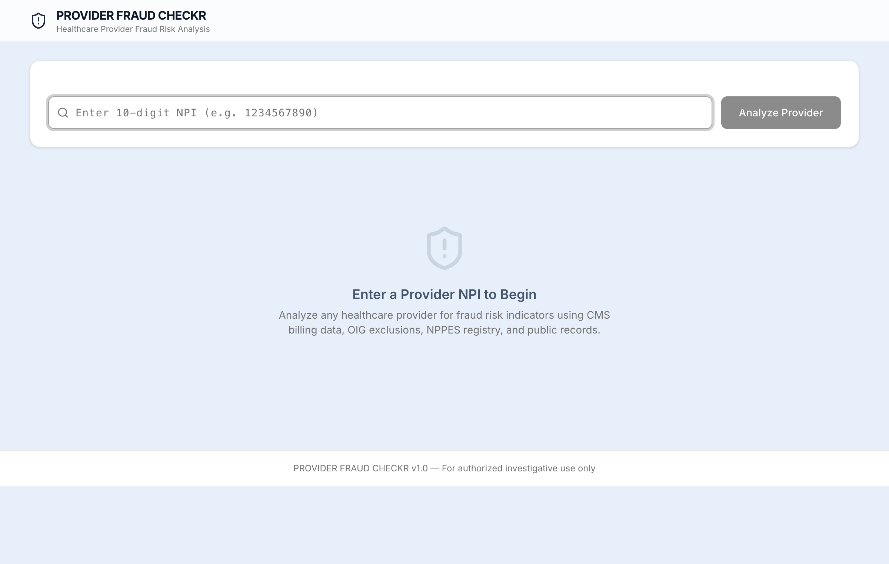

# PROVIDER FRAUD CHECKR

**AI-powered healthcare provider fraud risk analysis in under 30 seconds.**

PROVIDER FRAUD CHECKR is a multi-agent investigation platform that analyzes healthcare providers for suspicious billing patterns, exclusion records, and legal history. It pulls from four government data sources, runs statistical anomaly detection, and generates professional investigation reports — all through a modern React interface with real-time progress streaming.



---

## How It Works

A 4-agent AI pipeline processes each investigation:

```
NPI Input --> Research Agent --> Pattern Analyzer --> Report Writer --> Quality Checker --> Report
               (parallel          (statistical         (Claude AI        (validation
              data collection)    anomaly detection)    summary)          & QA)
```

1. **Research Agent** — Collects data in parallel from CMS, OIG, NPPES, and web search
2. **Pattern Analyzer** — Runs Z-score anomaly detection against peer baselines using scipy/sklearn
3. **Report Writer** — Generates an executive summary and recommendations via Claude AI
4. **Quality Checker** — Validates completeness, evidence accuracy, and regulatory compliance

Total analysis time: **< 30 seconds**.

---

## Features

- **Real-time SSE progress** — Watch each pipeline stage complete live in the browser
- **Risk scoring (0-100)** — Weighted multi-factor algorithm with color-coded severity gauge
- **Evidence table** — Sortable findings with statistical significance, severity, and source attribution
- **Data source cards** — Visual status for each API source (CMS, OIG, NPPES, web search)
- **Severity breakdown** — Pie chart visualization of evidence by severity level
- **Financial impact** — Estimated fraud amounts, settlements, and restitution data
- **PDF export** — One-click professional report download for compliance teams
- **Graceful degradation** — Continues analysis with partial data if any source is unavailable
- **Intelligent caching** — Per-source TTLs (CMS: 24h, OIG: 30d, NPPES: 7d) for fast repeat lookups

---

## Tech Stack

| Layer | Technology |
|-------|------------|
| **Frontend** | React 19, TypeScript, Vite 7, Tailwind CSS 4, shadcn/ui, Recharts |
| **Backend** | FastAPI, Python 3.11, uvicorn, SSE (sse-starlette) |
| **AI/ML** | Anthropic Claude Haiku (reports), scipy + scikit-learn (anomaly detection) |
| **Data Sources** | CMS Open Data API, OIG Exclusion Database, NPPES Registry, DuckDuckGo Search |
| **Export** | ReportLab (PDF generation) |
| **Deployment** | Render (render.yaml) |

---

## Quick Start

### Prerequisites

- Python 3.11+
- Node.js 18+
- [Anthropic API key](https://console.anthropic.com/)

### Setup

```bash
# Clone the repository
git clone https://github.com/achihohochi/PROVIDER_FRAUD_CHECKR.git
cd PROVIDER_FRAUD_CHECKR

# Create .env file
echo "ANTHROPIC_API_KEY=your_key_here" > .env

# Install Python dependencies
python -m venv venv
source venv/bin/activate
pip install -r requirements.txt
pip install -r app/requirements.txt

# Install and build the frontend
cd app/frontend && npm install && npm run build && cd ../..
```

### Run

```bash
source venv/bin/activate
python -m uvicorn app.backend.main:app --port 8000
```

Open **http://localhost:8000** and enter any 10-digit NPI to begin an investigation.

### Development Mode (hot reload)

```bash
# Terminal 1 — Backend
source venv/bin/activate
python -m uvicorn app.backend.main:app --port 8000 --reload

# Terminal 2 — Frontend
cd app/frontend && npm run dev
```

---

## API Endpoints

| Method | Endpoint | Description |
|--------|----------|-------------|
| `POST` | `/api/analyze/{npi}` | Start analysis, returns job ID |
| `GET` | `/api/analyze/{npi}/stream` | SSE stream of pipeline progress |
| `GET` | `/api/report/{npi}` | Completed investigation report (JSON) |
| `GET` | `/api/report/{npi}/pdf` | Download PDF report |
| `GET` | `/api/health` | Health check |

---

## Data Sources

| Source | Data Provided | Auth Required | Cache TTL |
|--------|--------------|---------------|-----------|
| **CMS Open Data** | Medicare billing patterns, utilization, charges | No | 24 hours |
| **OIG Exclusions** | Sanctions, exclusions from federal programs | No | 30 days |
| **NPPES Registry** | Credentials, specialty, practice location | No | 7 days |
| **Web Search** | Legal records, court filings, news articles | No | 30 days |

All data sources are free public APIs. The only paid dependency is the Anthropic API for AI-generated report summaries (~$0.01 per investigation).

---

## Understanding Risk Scores

| Score | Priority | Meaning | Recommended Action |
|-------|----------|---------|-------------------|
| **0 - 29** | Low | Normal billing patterns | Routine monitoring |
| **30 - 69** | Medium | Anomalies detected | Further review recommended |
| **70 - 100** | High | Multiple fraud indicators | Immediate investigation |

---

## Project Structure

```
PROVIDER_FRAUD_CHECKR/
├── app/
│   ├── frontend/              # React + TypeScript + Vite
│   │   └── src/
│   │       ├── pages/         # AnalyzePage (main UI)
│   │       ├── components/    # 13 UI components (gauge, table, charts, etc.)
│   │       ├── hooks/         # useAnalysis state management
│   │       └── api/           # SSE client, fetch helpers
│   └── backend/
│       ├── main.py            # FastAPI entry point
│       └── api/
│           ├── routes.py      # REST endpoints
│           └── sse.py         # Real-time progress streaming
├── agents/
│   ├── research_agent.py      # Parallel data collection
│   ├── pattern_analyzer.py    # Statistical fraud detection
│   ├── report_writer.py       # Claude AI report generation
│   └── quality_checker.py     # Report validation & QA
├── services/
│   ├── cms_service.py         # CMS Open Data API
│   ├── oig_service.py         # OIG Exclusion Database
│   ├── nppes_service.py       # NPPES Registry API
│   ├── web_search_service.py  # DuckDuckGo legal search
│   ├── export_service.py      # PDF report generation
│   └── data_service.py        # Data orchestration & fusion
├── workflow.py                # Multi-agent pipeline orchestration
├── models.py                  # Pydantic data models
├── config.py                  # Environment & API configuration
└── render.yaml                # Render deployment config
```

---

## Privacy & Security

- **No PHI** — Only uses publicly available government data
- **Local processing** — All analysis runs on your machine
- **API keys** — Stored in `.env`, never committed to version control
- **CORS restricted** — Limited to localhost in development

---

## Cost

| Item | Cost |
|------|------|
| Data sources (CMS, OIG, NPPES) | Free |
| Web search (DuckDuckGo) | Free |
| Claude AI (report generation) | ~$0.01 per investigation |
| **Estimated monthly cost** | **< $5** |

---

## License

MIT License
